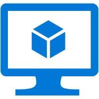
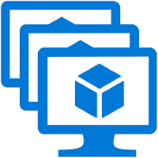
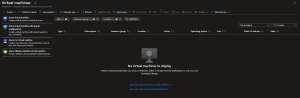
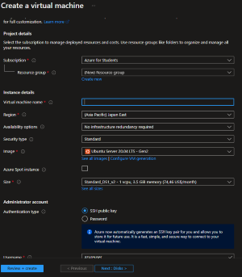
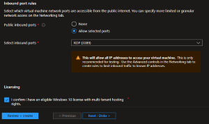
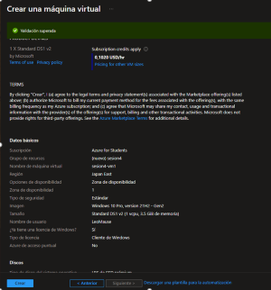
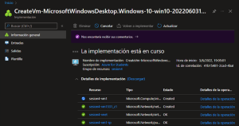
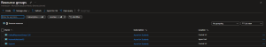
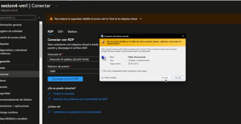

PRACTICA DE MAQUINAS VIRTUALES
-------------------------------------

El programa que usaremos para crear la maquina virtual es **Azure Virtual Machines**

Este programa lo que hace, es virtualizar el hardware de la computadora. Es decir mete una computadore dentro de otra computadora.

- **Modelo de Servicio:** IaaS
- **Control:** Nosotros tendremos el control total del sistema operativo.
- **Usos:** Se utiliza en Software o necesidades especificas.

- **Uso:** Para extender el centro de datos
- **Uso:** Para pruebas y desarrollo de aplicaciones

AZURE VIRTUAL MACHINES SCALE SETS

Es un servicio para poder controlar muchas maquinas Virtuales.

- **Modelo de servicio:** IaaS
- **Funcion:** Controlar facilmente muchas maquinas virtuales
- **Usos:** Para aumentarlas o disminuirlas
- **Usos:** Replica maquinas virtuales y administra todas de un jalon
- **Usos:** Sirve para disminuir el trabajo.

-----------------------------------

####Pasos para crear una Maquina Virtual

1.-Ingresamos al [Portal de Azure](https://portal.azure.com)

2.- Buscamos Virtual Machine en el buscador.

3.- Cuando cargue, le daremos en crear y en Maquina Virtual.
 **Para crearla se necesita: Suscripcion, grupo de recursos, nombre y region.**
 
 
4.- Creamos un nuevo grupo de recursos (le ponemos el nombre que queramos).

 

5.- Le agregamos el nombre que queremos para nuestra Maquina Virtual.

6.- Seleccionamos una region que este accesible y que tenga disponibilidad, de preferencia en zona 1.

7.- Todo lo demas lo dejamos tal cual esta.

8.- En imagen seleccionamos la que vamos a ocupar (en este caso fue Windows 10 Pro)

9.- En el tamaño seleccionamos la quremos usar, pero tomando en cuenta que nos cobrara cada hora aun que no la estemos usando.

10.- Agregamos un Nombre de Usuario

11.- Agregamos una contraseña y la confirmamos.

12.- En este caso, seleccionaremos el puerto **RDP** **(remote deskop Protocol)**
13.- Confirmamos el uso de la Maquina Virtual

14.- Nos vamos al apartado de Redes, lo dejamos tal cual esta.
15.- A continuacion le damos en revisar y crear. Le damos en crear.

16.- Esperamos a que la implementacion termine.

17.- Una ves creada esa Maquina Virtual, procedemos a crear una **segunda Maquina Virtual** con los mismos pasos **(checar que este en el mismo grupo de recursos que primera maquina virtual)**.

18.- Una ves creada la segunda Maquina Virtual, iremos a nuestro **grupo de recursos**.

19.- Ahora le daremos "click" a una Maquina Virtual.

20.- Le daremos en la flechita que tiene pegado conectar y luego en **RDP**.

21.- Esperamos tantito y descargamos ese archivo.
22.- En Windows, para usar el archivo **RDP**, debemos descargar la aplicacion **Remote Desktop** del storage de Windows y lo instalaremos (esto nos va a permitir conectarnos a las maquinas virtuales).

23.-Una ves que se descargue la aplicacion abriremos el archivo. Cuando abra nos pedira el Usuario y la contraseña que habiamos anotado anteriormente y se abrira la maquina virtual.

24.-Ahora para conectar la otra maquina virtual debemos abrir el CMD y escribir **ping y el ping de la maquina virtual** que queremos conectar.

26.- En caso de que no conecte por el CMD, deberemos abrir el **Windows Powershell**

27.- Aca en el Windows PowerShell escribiremos, **New-NetFirewallRule -DisplayName "Allow ICMPv4-In" -Protocol ICMPv4**. 

28.- Ahora veremos si podemos conectar la otra maquina virtual, escribiremos  **mstsc /v:y el ping de la maquina virtual**.

29.- Automaticamente nos saldra un recuadro nuevamente pidiendo el usuario y la contraseña
30.- Listo, tendremos ahora si conectada la otra maquina virtual.
31.- Tendremos finalmente una Maquina Virtual dentro de otra Maquina Virtual.
 

-----------------------------------------------------------------------------------------------------------
